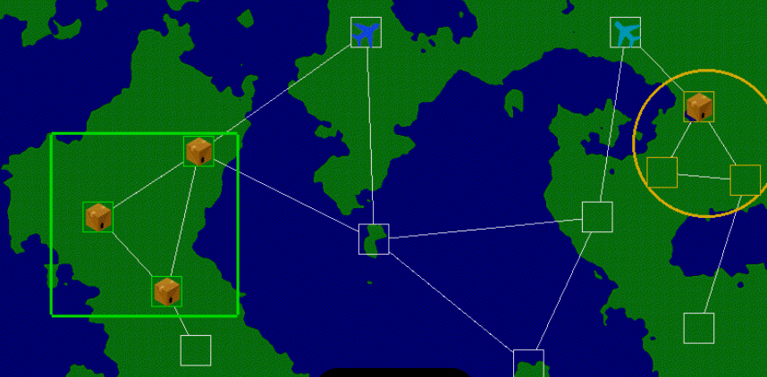
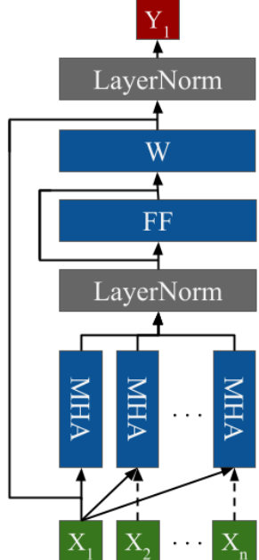
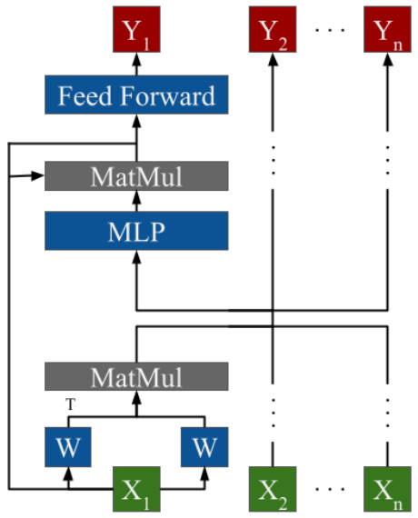
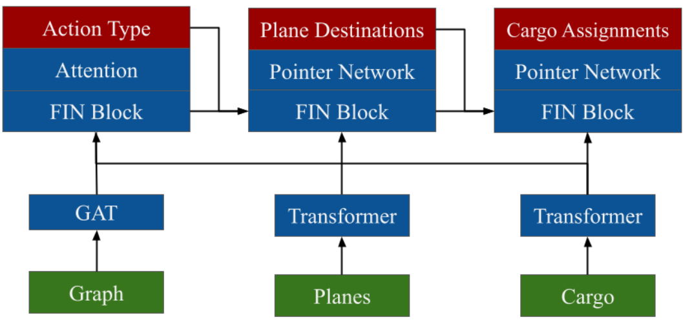
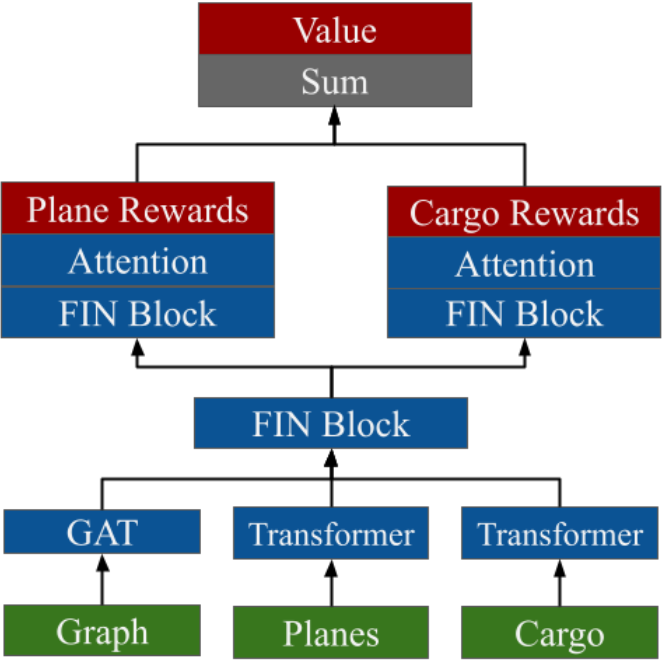

# Flexible Input Networks: Set of Sets Neural Architectures Applied to the Airlift Challenge
By: Thomas Blalock 
Date: September 27, 2024

## Summary
In this project, I introduce a novel class of neural architectures designed to handle a set of dynamically sized inputs (set of sets) without pre-decoder aggregations, recurrence, or autoregression. This project applies FINs to the Airlift Challenge, a complex Pickup and Delivery Problem (PDP) instance formulated by the Air Force Research Laboratory. This project is in-progress and is up-to-date as of September 27, 2024. For a concise summary, reference a 5 minute video poster presentation [here](https://drive.google.com/file/d/1cr0xx7AcpoGLJWMsXrsaG_P0eAAwiG68/view?usp=sharing).

## Table of Contents
1. [QuickStart](#quickstart)
2. [Introduction](#introduction)
3. [Usage](#usage)
4. [Methodology](#methodology)

## Introduction
I introduce Flexible Input Networks (FINs), a new class of neural architectures designed to process a set of dynamically sized inputs (set of sets) without pre-decoder aggregations, recurrence, or autoregression. Problems where the input or output is a set of sets, such as certain Pickup and Delivery Problems (PDPs) or multi-agent reinforcement learning problems (MARLs), cannot be trivially addressed with current mechanisms. Rather, current approaches require iterative processing, which coordinates actions in a solution space suboptimally. This paper addresses this problem by formulating a class of neural architectures that can reason about the global context while maintaining a separate embedding for each object of each input set. This paper applies FINs to the Airlift Challenge, which is an instance of the Pickup and Delivery Problem (PDP). Using FINs, this paper designs the first multi-agent reinforcement learning (MARL) system to process a set of sets (a graph, a set of airplanes, and a set of cargo orders) into a set of actions for each agent without any pre-decoder aggregation, recurrence, or autoregression. Two FIN variants are presented: Self-Projection (SP) and Mixing Attention (MA), each offering unique advantages.

## The Airlift Challenge
 
The Airlift Challenge is a benchmark created by the Air Force Research Laboratory (AFRL) to prompt innovation in deep reinforcement learning applications to airlift logistics problems. It simulates airlift logistics with a dynamically generated map and randomized perturbations and constraints that would occur in the real world. You can learn more about the Airlift Challenge at their [Ibsite](https://airliftchallenge.com/chapters/main.html).

## Flexible Inpute Network (FIN)
FINs are a class of neural architectures. FINs are greatly useful for combinatorial problems like PDPs and the Airlift Challenge where a model must reason across a set of sets. In this project, I invented two type of FINs: Mixing Attention and Self Projection. 
*Mixing Attention:* 
 
*Self-Projection:* 
 

## Reinforcement Learning Algorithm
This project uses proximal policy optimization (PPO), which is an on-policy reinforcement learning algorithm. It is an actor-critic architecture requiring a model to output actions and a model to help calculate the advantage value Learn more about PPO at this [article](https://arxiv.org/abs/1707.06347).

## Model Architectures

### Policy Network
The policy network contains three heads: an action head, destination head, and cargo assignment head. The action head receives the three embedding matrices and uses a FIN block and an Attention mechanism to output the action matrix. The destinations head outputs where each plane wil take off too, masked to only include planes that Ire selected to take off. The cargo assignments head outputs the matrix describing what cargo will be loaded onto which planes.

### Critic Network
The reward for the environment is calculated based on missed/late deliveries and fuel costs. The critic network, therefore, splits the costs into these natural categories via a plane rewards head and a cargo rewards head and sums the results.

## Results
This is an on-going project. The results for this project are still pending.
